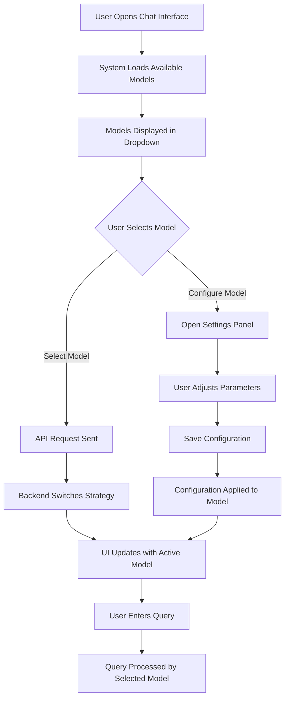

# Interactive Model Selection in SQL Chat Assistant

> *A comprehensive implementation of the Strategy Pattern for flexible AI model selection*

## Table of Contents

- [Problem Statement](#problem-statement)
- [Design Pattern Used: Strategy Pattern](#design-pattern-used-strategy-pattern)
  - [What is the Strategy Pattern?](#what-is-the-strategy-pattern)
  - [Implementation Details](#implementation-details)
  - [Code Structure](#code-structure)
  - [UML Class Diagram](#uml-class-diagram-conceptual)
  - [Key Benefits of the Strategy Pattern](#key-benefits-of-the-strategy-pattern)
  - [Implementation Flow](#implementation-flow)
  - [Client Interface](#client-interface)
  - [Strategy Pattern vs Other Patterns](#strategy-pattern-vs-other-patterns)
- [Front-End Model Selection Implementation](#front-end-model-selection-implementation)
  - [UI Components](#ui-components)
  - [Front-End Architecture](#front-end-architecture)
  - [User Interaction Flow](#user-interaction-flow)
  - [API Integration](#api-integration)
  - [State Management](#state-management)
  - [User Experience Considerations](#user-experience-considerations)
  - [Integration with Strategy Pattern](#integration-with-strategy-pattern)
- [Summary and Conclusion](#summary-and-conclusion)

---

## Problem Statement

The SQL Chat Assistant requires a flexible model selection mechanism that:

✅ Lists available models (e.g., "1. GPT-4 | 2. Llama-3 | 3. Mistral-7B")  
✅ Accepts user input to select a model  
✅ Shows confirmation of active model (e.g., "[Current Model: Llama-3] Enter your query:")  
✅ Allows model switching without restarting the application

---

## Design Pattern Used: Strategy Pattern

### What is the Strategy Pattern?

> The Strategy Pattern defines a family of algorithms, encapsulates each one, and makes them interchangeable. Strategy lets the algorithm vary independently from clients that use it.


### Implementation Details

#### 1. Strategy Interface (`ModelStrategy`)

The foundation of our implementation is the `ModelStrategy` interface, which defines:

- `generate_content()`: Produces text output from a given prompt
- `get_model_name()`: Returns the model's display name
- `get_model_description()`: Provides detailed information about the model

#### 2. Concrete Strategies

Each AI model is implemented as a concrete strategy:

| Model | Description | Best Use Case |
|-------|-------------|---------------|
| `GeminiProModel` | Google's Gemini Pro | Balanced performance |
| `GeminiUltraModel` | Google's Gemini Ultra | Highest quality results |
| `MistralModel` | Mistral 7B | Fast, lightweight tasks |
| `LlamaModel` | Meta's Llama 3 | General purpose |

#### 3. Context (`ModelContext`)

The `ModelContext` class:
- Maintains a reference to the current strategy (model)
- Delegates operations to the selected model
- Provides methods to switch models at runtime

#### 4. Model Registry

The `ModelRegistry`:
- Maintains the collection of available models
- Facilitates model selection and retrieval
- Handles model initialization and configuration

### Code Structure

```python
# Strategy Interface
class ModelStrategy(ABC):
    @abstractmethod
    def generate_content(self, prompt: str) -> Any:
        """Generate content using the model"""
        pass

    @abstractmethod
    def get_model_name(self) -> str:
        """Get the name of the model"""
        pass
    
    @abstractmethod
    def get_model_description(self) -> str:
        """Get a description of the model"""
        pass

# Concrete Strategies
class GeminiProModel(ModelStrategy):
    """Gemini Pro model implementation"""
    
    def __init__(self, api_key: str, temperature: float = 0.7):
        genai.configure(api_key=api_key)
        self.model_name = "gemini-1.0-pro"
        self.model = genai.GenerativeModel(self.model_name, generation_config={
            "temperature": temperature
        })
    
    def generate_content(self, prompt: str) -> Any:
        return self.model.generate_content(prompt)
    
    def get_model_name(self) -> str:
        return "Gemini Pro"
    
    def get_model_description(self) -> str:
        return "Google's Gemini Pro model - balanced performance"

# Context Class
class ModelContext:
    def __init__(self, api_key: str):
        self.registry = ModelRegistry(api_key)
        self.api_key = api_key
    
    def generate_content(self, prompt: str) -> Any:
        """Delegates content generation to the selected strategy"""
        return self.registry.generate_content(prompt)
    
    def select_model(self, model_id: str) -> bool:
        """Switches to a different strategy at runtime"""
        return self.registry.select_model(model_id)
    
    def get_current_model_info(self) -> Dict[str, str]:
        """Gets information about the current strategy"""
        current_model = self.get_current_model()
        return {
            "name": current_model.get_model_name(),
            "description": current_model.get_model_description()
        }
```

### UML Class Diagram (Conceptual)

```
┌───────────────────┐      ┌────────────────┐      ┌─────────────────┐
│   ModelContext    │      │  ModelRegistry  │      │  ModelStrategy  │
├───────────────────┤      ├────────────────┤      ├─────────────────┤
│ - registry        │─────▶│ - models       │─────▶│ + generate_     │
│ - api_key         │      │ - current_model│      │   content()     │
├───────────────────┤      ├────────────────┤      │ + get_model_    │
│ + generate_       │      │ + select_model │      │   name()        │
│   content()       │      │ + generate_    │      │ + get_model_    │
│ + select_model()  │      │   content()    │      │   description() │
│ + get_current_    │      └────────────────┘      └─────────────────┤
│   model_info()    │                               ▲         ▲      │
└───────────────────┘                               │         │      │
                                                    │         │      │
                                                    │         │      │
                           ┌─────────────────┬──────┘         │      │
                           │                 │                │      │
                           │                 │                │      │
                  ┌────────▼─────┐  ┌───────▼────────┐  ┌────▼─────────┐
                  │ GeminiProModel│  │ MistralModel  │  │ LlamaModel   │
                  └────────────────┘  └───────────────┘  └──────────────┘
```

### Key Benefits of the Strategy Pattern

1. **Runtime Model Selection** ⚡
   - Models can be switched dynamically without restarting the application
   - The client code remains unaware of the specific model implementation

2. **Simplified Client Code** 📝
   - Client code works with a consistent interface (ModelContext)
   - Implementation details of individual models are hidden

3. **Easy Extension** 🧩
   - New models can be added by implementing the ModelStrategy interface
   - No modification to existing code is required (Open/Closed Principle)

4. **Separation of Concerns** 🔄
   - Model implementations are decoupled from the selection logic
   - Each model focuses on its own generation algorithm

5. **Single Responsibility** 🎯
   - Each model class has one responsibility (generating content)
   - The ModelRegistry handles the selection logic

### Implementation Flow

The following sequence diagram shows how model selection works:

```
┌─────┐          ┌────────────┐          ┌──────────────┐          ┌───────────┐
│User │          │ModelContext│          │ModelRegistry │          │ModelStrategy│
└──┬──┘          └─────┬──────┘          └──────┬───────┘          └─────┬─────┘
   │                   │                        │                        │
   │ select_model("1") │                        │                        │
   │──────────────────>│                        │                        │
   │                   │ select_model("1")      │                        │
   │                   │───────────────────────>│                        │
   │                   │                        │ create new strategy    │
   │                   │                        │───────────────────────>│
   │                   │                        │                        │
   │                   │                        │ strategy instance      │
   │                   │                        │<───────────────────────│
   │                   │                        │                        │
   │                   │ success                │                        │
   │                   │<───────────────────────│                        │
   │ success           │                        │                        │
   │<──────────────────│                        │                        │
   │                   │                        │                        │
   │ generate("SQL query")                      │                        │
   │──────────────────>│                        │                        │
   │                   │ generate_content()     │                        │
   │                   │───────────────────────>│                        │
   │                   │                        │ generate_content()     │
   │                   │                        │───────────────────────>│
   │                   │                        │                        │
   │                   │                        │ result                 │
   │                   │                        │<───────────────────────│
   │                   │ result                 │                        │
   │                   │<───────────────────────│                        │
   │ SQL result        │                        │                        │
   │<──────────────────│                        │                        │
   │                   │                        │                        │
```

### Client Interface

The implementation includes an interactive CLI client that demonstrates all features:

```
===== SQL Chat Assistant - Interactive Client =====
API URL: http://localhost:8001
Loaded 4 available models.

Current Model: Gemini Pro

Options:
1. Set database URL
2. List available models
3. Select model
4. Execute query
5. Exit

Enter your choice (1-5): 2

===== Available Models =====
1. Gemini Pro - Google's Gemini Pro model - balanced performance (CURRENT)
2. Gemini Ultra - Google's most capable model - highest quality, slower speed
3. Mistral-7B - Lightweight open-source model - fast performance
4. Llama-3 - Meta's Llama-3 model - good balance of quality and speed
===========================

Enter your choice (1-5): 3

===== Available Models =====
1. Gemini Pro - Google's Gemini Pro model - balanced performance (CURRENT)
2. Gemini Ultra - Google's most capable model - highest quality, slower speed
3. Mistral-7B - Lightweight open-source model - fast performance
4. Llama-3 - Meta's Llama-3 model - good balance of quality and speed
===========================

Enter model ID to select: 4
Successfully selected model: Llama-3

Current Model: Llama-3
```

### Strategy Pattern vs Other Patterns

| Pattern | Focus | When to Use Instead |
|---------|-------|---------------------|
| **Strategy** | Algorithm encapsulation | When you need to switch behaviors at runtime |
| Factory Method | Object creation | When focusing only on object creation, not behavior |
| Command | Request encapsulation | When you need to queue, log, or undo operations |
| Decorator | Dynamic behavior addition | When adding features to objects without subclassing |

---

## Front-End Model Selection Implementation

### UI Components

The front-end implementation of the model selection feature involves several key components:


1. **ModelSelectionDropdown**
   - A dropdown component that displays available models
   - Highlights the currently selected model
   - Implements responsive design for both desktop and mobile views

2. **ModelInfoCard**
   - Displays detailed information about each model
   - Shows capabilities, performance metrics, and tier requirements
   - Provides visual indicators for model status (active/inactive)

3. **ModelSettingsPanel**
   - Allows users to configure model-specific parameters (temperature, max tokens)
   - Provides preset configurations for different use cases
   - Saves user preferences per model

### Front-End Architecture

```
┌─────────────────────────────┐
│       ChatInterface         │
└───────────────┬─────────────┘
                │
                ▼
┌─────────────────────────────┐      ┌─────────────────────────┐
│    ModelSelectionContext    │◄────►│     ModelApiService     │
└───────────────┬─────────────┘      └─────────────────────────┘
                │                              │
                ▼                              ▼
┌─────────────────────────────┐      ┌─────────────────────────┐
│    ModelSelectionDropdown   │      │      API Endpoints      │
└───────────────┬─────────────┘      └─────────────────────────┘
                │
        ┌───────┴───────┐
        │               │
        ▼               ▼
┌─────────────┐  ┌─────────────────┐
│ModelInfoCard│  │ModelSettingsPanel│
└─────────────┘  └─────────────────┘
```

### User Interaction Flow

The following flowchart illustrates how users interact with the model selection UI:



### API Integration

The front-end components communicate with the back-end Strategy pattern implementation through a dedicated API service:

```javascript
// ModelApiService.js
class ModelApiService {
  // Fetch available models based on user's subscription tier
  async getAvailableModels() {
    const response = await fetch('/api/models/available');
    return await response.json();
  }

  // Select a model for the current session
  async selectModel(modelId) {
    const response = await fetch('/api/models/select', {
      method: 'POST',
      headers: { 'Content-Type': 'application/json' },
      body: JSON.stringify({ modelId })
    });
    return await response.json();
  }

  // Get current model information
  async getCurrentModel() {
    const response = await fetch('/api/models/current');
    return await response.json();
  }

  // Update model configuration
  async updateModelConfig(modelId, config) {
    const response = await fetch(`/api/models/${modelId}/config`, {
      method: 'PUT',
      headers: { 'Content-Type': 'application/json' },
      body: JSON.stringify(config)
    });
    return await response.json();
  }
}
```

### State Management

The application uses a ModelSelectionContext to manage the state of model selection across the UI:

```javascript
// ModelSelectionContext.js
import React, { createContext, useState, useEffect } from 'react';
import ModelApiService from './ModelApiService';

const ModelSelectionContext = createContext();
const api = new ModelApiService();

export const ModelSelectionProvider = ({ children }) => {
  const [availableModels, setAvailableModels] = useState([]);
  const [currentModel, setCurrentModel] = useState(null);
  const [isLoading, setIsLoading] = useState(false);
  const [error, setError] = useState(null);

  // Load available models on component mount
  useEffect(() => {
    loadAvailableModels();
    loadCurrentModel();
  }, []);

  const loadAvailableModels = async () => {
    setIsLoading(true);
    try {
      const models = await api.getAvailableModels();
      setAvailableModels(models);
    } catch (err) {
      setError('Failed to load available models');
      console.error(err);
    } finally {
      setIsLoading(false);
    }
  };

  const loadCurrentModel = async () => {
    setIsLoading(true);
    try {
      const model = await api.getCurrentModel();
      setCurrentModel(model);
    } catch (err) {
      setError('Failed to load current model');
      console.error(err);
    } finally {
      setIsLoading(false);
    }
  };

  const selectModel = async (modelId) => {
    setIsLoading(true);
    try {
      const result = await api.selectModel(modelId);
      if (result.success) {
        setCurrentModel(result.model);
        return true;
      } else {
        setError(result.message || 'Failed to select model');
        return false;
      }
    } catch (err) {
      setError('An error occurred while selecting the model');
      console.error(err);
      return false;
    } finally {
      setIsLoading(false);
    }
  };

  return (
    <ModelSelectionContext.Provider
      value={{
        availableModels,
        currentModel,
        isLoading,
        error,
        selectModel,
        refreshModels: loadAvailableModels,
      }}
    >
      {children}
    </ModelSelectionContext.Provider>
  );
};

export const useModelSelection = () => {
  return React.useContext(ModelSelectionContext);
};
```

### User Experience Considerations

<table>
  <tr>
    <th>Consideration</th>
    <th>Implementation Details</th>
    <th>User Benefit</th>
  </tr>
  <tr>
    <td><strong>Subscription-Aware UI</strong></td>
    <td>
      - Models not available on user's subscription tier are shown as locked<br>
      - Upgrade prompts appear when attempting to select a higher-tier model<br>
      - Free tier users see performance comparisons to encourage upgrades
    </td>
    <td>Clear visibility of available features with transparent upgrade paths</td>
  </tr>
  <tr>
    <td><strong>Performance Transparency</strong></td>
    <td>
      - Each model displays estimated response times and token usage<br>
      - Historical performance metrics are shown when available<br>
      - Users can view sample outputs for different models before selecting
    </td>
    <td>Informed decision-making for selecting the most appropriate model</td>
  </tr>
  <tr>
    <td><strong>Contextual Recommendations</strong></td>
    <td>
      - System suggests optimal models based on user's query complexity<br>
      - Time-sensitive requests auto-suggest faster models<br>
      - Complex analytical queries suggest more capable models
    </td>
    <td>Guided experience that optimizes for best results</td>
  </tr>
  <tr>
    <td><strong>Progressive Enhancement</strong></td>
    <td>
      - Basic model selection works even with JavaScript disabled<br>
      - Advanced features like real-time model comparisons require full JS support<br>
      - Fallback options ensure core functionality in all environments
    </td>
    <td>Reliable experience across different devices and connection qualities</td>
  </tr>
</table>

### Integration with Strategy Pattern

The front-end model selection seamlessly integrates with the back-end Strategy pattern:

1. When a user selects a model in the UI, the system:
   - Calls the `/api/models/select` endpoint
   - The endpoint invokes `ModelContext.select_model()`
   - The Strategy pattern switches the concrete implementation
   - Subsequent requests use the newly selected model

2. The UI reflects the current state of the ModelContext:
   - Active model indicators sync with backend state
   - Model capabilities shown match the concrete strategy's capabilities
   - Error states propagate from backend strategy failures

This tight integration ensures the user experience accurately reflects the system's actual behavior while maintaining the separation of concerns that makes the Strategy pattern so effective.

---

## Summary and Conclusion

The Strategy pattern provides an ideal solution for implementing an interactive model chooser in the SQL Chat Assistant. It allows for runtime switching between different language models without requiring application restarts, promotes clean separation of concerns, and makes the system extensible for adding new models in the future.

The front-end implementation complements the back-end strategy pattern with an intuitive, responsive user interface that makes model selection and configuration accessible to users of all technical levels.

Key takeaways:

- ✅ **Flexibility**: Models can be added or removed without modifying client code
- ✅ **Maintainability**: Separation of concerns makes the codebase easier to maintain
- ✅ **Scalability**: New models can be integrated by implementing a common interface
- ✅ **User Experience**: Intuitive UI makes complex model selection accessible
- ✅ **Performance**: Dynamic model selection optimizes for different use cases

This approach enhances the application's flexibility while maintaining a clean, modular architecture that follows SOLID principles. 