# Updated Design Class Diagram for SQL Chat Assistant

## PlantUML Code with Improved Relationships

```plantuml
@startuml SQL_Chat_Assistant_Design

' Style settings
skinparam classAttributeIconSize 0
skinparam monochrome true
skinparam shadowing false
skinparam linetype ortho

' Abstract base classes
abstract class BaseEntity {
  - id: String
  - createdAt: Date
  - updatedAt: Date
  + getId(): String
  + getCreatedAt(): Date
  + getUpdatedAt(): Date
  + toJSON(): Object
  # beforeSave(): void
}

abstract class BaseService {
  # logger: Logger
  + initialize(): void
  + handleError(error: Error): void
  # logInfo(message: String): void
  # logError(message: String, error: Error): void
}

' Interfaces
interface IValidator {
  + validate(data: any): Promise<boolean>
}

interface IRepository<T> {
  + find(id: String): Promise<T>
  + findAll(filter?: Object): Promise<T[]>
  + create(data: Object): Promise<T>
  + update(id: String, data: Object): Promise<boolean>
  + delete(id: String): Promise<boolean>
}

' Domain entities
class User extends BaseEntity {
  - name: String
  - email: String {unique}
  - passwordHash: String
  - role: UserRole
  - isActive: boolean
  - lastLogin: Date
  + User(name: String, email: String, password: String)
  + register(): Promise<boolean>
  + login(password: String): Promise<Token>
  + logout(): Promise<boolean>
  + resetPassword(email: String): Promise<boolean>
  + updateProfile(data: UserProfileData): Promise<boolean>
  + changePassword(oldPassword: String, newPassword: String): Promise<boolean>
  - validatePassword(password: String): boolean
}

enum UserRole {
  USER
  ADMIN
}

class DatabaseConnection extends BaseEntity {
  - userId: String
  - name: String
  - type: ConnectionType
  - connectionString: String {encrypted}
  - isActive: boolean
  - lastUsed: Date
  + DatabaseConnection(userId: String, name: String, type: ConnectionType, connectionString: String)
  + testConnection(): Promise<boolean>
  + connect(): Promise<Connection>
  + disconnect(): Promise<boolean>
  + getSchema(): Promise<Schema>
  + save(): Promise<boolean>
  + update(data: ConnectionData): Promise<boolean>
  + delete(): Promise<boolean>
  - encryptConnectionString(connectionString: String): String
  - decryptConnectionString(encrypted: String): String
}

enum ConnectionType {
  POSTGRESQL
  MYSQL
  SQLSERVER
}

class ChatSession extends BaseEntity {
  - userId: String
  - connectionId: String
  - title: String
  - messages: ChatMessage[]
  + ChatSession(userId: String, connectionId: String, title: String)
  + create(): Promise<boolean>
  + getMessages(): Promise<ChatMessage[]>
  + addMessage(content: String, role: MessageRole, sqlQuery?: String): Promise<boolean>
  + updateTitle(title: String): Promise<boolean>
  + delete(): Promise<boolean>
  + export(): Promise<File>
}

class ChatMessage extends BaseEntity {
  - sessionId: String
  - role: MessageRole
  - content: String
  - sqlQuery: String
  + ChatMessage(sessionId: String, role: MessageRole, content: String, sqlQuery?: String)
  + save(): Promise<boolean>
  + delete(): Promise<boolean>
  + generateResponse(): Promise<String>
}

enum MessageRole {
  USER
  ASSISTANT
  SYSTEM
}

class UserSettings extends BaseEntity {
  - userId: String
  - queryTimeout: Integer
  - autoDisconnect: boolean
  - showSqlQueries: boolean
  - theme: ThemeType
  + UserSettings(userId: String)
  + save(): Promise<boolean>
  + update(settings: SettingsData): Promise<boolean>
  + getSettings(): Promise<UserSettings>
}

enum ThemeType {
  LIGHT
  DARK
  SYSTEM
}

' Service classes
class AuthenticationManager extends BaseService {
  - userRepository: UserRepository
  - jwtSecret: String
  - privateKey: String
  - publicKey: String
  - tokenExpiry: Integer
  + generateToken(userId: String): Promise<Token>
  + verifyToken(token: String): Promise<TokenPayload>
  + refreshToken(token: String): Promise<Token>
  + revokeToken(token: String): Promise<boolean>
  + hashPassword(password: String): Promise<String>
  + verifyPassword(hashedPassword: String, password: String): Promise<boolean>
  - signJWT(payload: Object): String
  - verifyJWT(token: String): TokenPayload
}

class SchemaVisualizer extends BaseService {
  - connectionId: String
  - tables: Table[]
  - relationships: Relation[]
  + fetchSchema(connectionId: String): Promise<Schema>
  + renderTables(): Promise<Component>
  + showRelationships(): Promise<Component>
  + getTableDetails(tableName: String): Promise<Table>
  + updateSchema(): Promise<boolean>
  - extractRelationships(schema: Schema): Relation[]
  - formatTableStructure(table: Table): TableComponent
}

class QueryProcessor extends BaseService implements IValidator {
  - apiKey: String
  - queryValidator: QueryValidator
  - sqlGenerator: SQLGenerator
  + processQuery(query: String, schema: Schema): Promise<SQL>
  + validateQuery(query: String): Promise<boolean>
  + generateSQL(query: String, schema: Schema): Promise<String>
  + verifySQL(sql: String, query: String): Promise<boolean>
  + optimizeQuery(sql: String): Promise<String>
  - preparePrompt(query: String, schema: Schema): String
  - postprocessSQL(sql: String): String
}

class QueryExecutor {
  - connectionId: String
  - sql: String
  - timeout: Integer
  - connection: Connection
  + execute(sql: String, params?: Object): Promise<QueryResult>
  + validateSyntax(sql: String): Promise<boolean>
  + formatResults(results: QueryResult): Promise<Object>
  + trackPerformance(queryId: String): Promise<Stats>
  + handleError(error: Error): Promise<Error>
  - prepareStatement(sql: String, params: Object): PreparedStatement
  - cleanSQLQuery(query: String): String
}

class QueryLogger extends BaseEntity implements IRepository<QueryLog> {
  - userId: String
  - connectionId: String
  - query: String
  - executionTime: Integer
  - status: QueryStatus
  - errorMessage: String
  + logQuery(query: String, executionTime: Integer, status: QueryStatus): Promise<boolean>
  + getStats(userId: String): Promise<Statistics>
  + searchLogs(criteria: SearchCriteria): Promise<QueryLog[]>
  + exportLogs(format: ExportFormat): Promise<File>
  - formatLogEntry(log: QueryLog): FormattedLog
}

enum QueryStatus {
  SUCCESS
  ERROR
}

' Repositories
class UserRepository implements IRepository<User> {
  + find(id: String): Promise<User>
  + findByEmail(email: String): Promise<User>
  + findAll(filter?: Object): Promise<User[]>
  + create(data: Object): Promise<User>
  + update(id: String, data: Object): Promise<boolean>
  + delete(id: String): Promise<boolean>
}

class ConnectionRepository implements IRepository<DatabaseConnection> {
  + find(id: String): Promise<DatabaseConnection>
  + findByUser(userId: String): Promise<DatabaseConnection[]>
  + findAll(filter?: Object): Promise<DatabaseConnection[]>
  + create(data: Object): Promise<DatabaseConnection>
  + update(id: String, data: Object): Promise<boolean>
  + delete(id: String): Promise<boolean>
}

' Inheritance relationships
BaseEntity <|-- User
BaseEntity <|-- DatabaseConnection
BaseEntity <|-- ChatSession
BaseEntity <|-- ChatMessage
BaseEntity <|-- UserSettings
BaseEntity <|-- QueryLogger

BaseService <|-- AuthenticationManager
BaseService <|-- SchemaVisualizer
BaseService <|-- QueryProcessor

IValidator <|.. QueryProcessor
IRepository <|.. UserRepository
IRepository <|.. ConnectionRepository
IRepository <|.. QueryLogger

' Enumeration type relationships
User "1" --> "1" UserRole : uses >
DatabaseConnection "1" --> "1" ConnectionType : uses >
ChatMessage "1" --> "1" MessageRole : uses >
UserSettings "1" --> "1" ThemeType : uses >
QueryLogger "1" --> "1" QueryStatus : uses >

' Unidirectional associations with full multiplicity on both sides
User "1" --> "0..*" DatabaseConnection : manages >
DatabaseConnection "0..*" --> "1" User : belongs to >

User "1" --> "0..*" ChatSession : owns >
ChatSession "0..*" --> "1" User : belongs to >

DatabaseConnection "1" --> "0..*" ChatSession : used in >
ChatSession "0..*" --> "1" DatabaseConnection : uses >

QueryProcessor "1" --> "1" QueryExecutor : uses >
QueryExecutor "1" --> "1" QueryProcessor : used by >

QueryExecutor "1" --> "1" QueryLogger : logs with >
QueryLogger "1" --> "1" QueryExecutor : records for >

UserRepository "1" --> "0..*" User : manages >
User "0..*" --> "1" UserRepository : managed by >

ConnectionRepository "1" --> "0..*" DatabaseConnection : manages >
DatabaseConnection "0..*" --> "1" ConnectionRepository : managed by >

' Bidirectional associations with full multiplicity
DatabaseConnection "1" <--> "1" SchemaVisualizer : visualizes
AuthenticationManager "1" <--> "1" User : authenticates

' Composition with full multiplicity
User "1" *-- "1" UserSettings : settings
UserSettings "1" --* "1" User : belongs to

ChatSession "1" *-- "0..*" ChatMessage : messages
ChatMessage "0..*" --* "1" ChatSession : part of

' Aggregation with full multiplicity
User "1" o-- "0..*" QueryLogger : logs
QueryLogger "0..*" --o "1" User : logged by

DatabaseConnection "1" o-- "1" QueryExecutor : executes
QueryExecutor "1" --o "1" DatabaseConnection : executes for

@enduml
```

## Key Improvements

1. **Complete Multiplicity Notation**:
   - Added multiplicity to both ends of EVERY relationship
   - For each association, explicitly shows cardinality on both sides
   - Also added relationship directions from the reverse perspective

2. **Enumeration Type Relationships**:
   - Added clear "1-to-1" multiplicity to enum relationships
   - Connected all enum types to their respective classes

3. **Bidirectional Relationships**:
   - Now properly shows multiplicity on both sides
   - Shows composition and aggregation in both directions

4. **Relationship Descriptions**:
   - Added descriptive text to opposite ends of relationships
   - For example: "manages" from User to DatabaseConnection, and "belongs to" from DatabaseConnection to User

## How to Use

1. Copy the PlantUML code above
2. Paste it into the [PlantUML Online Server](https://www.plantuml.com/plantuml/uml/)
3. The diagram will render with full multiplicity on all relationships

This updated diagram now strictly follows UML best practices by showing multiplicity on both sides of every relationship, making the model more precise and complete. 