# Updated Design Class Diagram for SQL Chat Assistant

## PlantUML Code with Current Implementation Structure

```plantuml
@startuml SQL_Chat_Assistant_Design

' Style settings
skinparam classAttributeIconSize 0
skinparam monochrome true
skinparam shadowing false
skinparam linetype ortho

' Base class/interface
abstract class BaseModel {
  + find(id: String): Promise<Entity>
  + findAll(filter?: Object): Promise<Entity[]>
  + create(data: Object): Promise<Entity>
  + update(id: String, data: Object): Promise<boolean>
  + delete(id: String): Promise<boolean>
}

interface IAuthenticable {
  + login(credentials: Object): Promise<Token>
  + register(userData: Object): Promise<User>
  + validateToken(token: String): Promise<boolean>
}

interface IValidator {
  + validate(data: any): Promise<boolean>
}

' Error handling
class AppError {
  - message: String
  - statusCode: Integer
  - details: String
  + constructor(message, statusCode, details?)
}

' Entity classes
class User {
  - id: String
  - name: String
  - email: String {unique}
  - passwordHash: String
  - role: String
  - isActive: boolean
  - lastLogin: Date
  - bio: String
  - company: String
  - image: Buffer
  + findById(id: String): Promise<User>
  + findByEmail(email: String): Promise<User>
  + create(userData: Object): Promise<User>
  + updateProfile(id: String, data: Object): Promise<boolean>
  + updatePassword(id: String, passwordHash: String): Promise<boolean>
  + updateLastLogin(id: String): Promise<void>
}

class DatabaseConnection {
  - id: String
  - userId: String
  - name: String
  - type: String
  - connectionString: String
  - isActive: boolean
  - lastUsed: Date
  + findById(id: String, userId: String): Promise<Connection>
  + findAllByUser(userId: String): Promise<Connection[]>
  + findRecentByUser(userId: String, limit: Number): Promise<Connection[]>
  + create(data: Object, userId: String): Promise<Connection>
  + delete(id: String, userId: String): Promise<boolean>
  + updateStatus(id: String, userId: String, isActive: boolean): Promise<boolean>
  + updateLastUsed(id: String): Promise<void>
}

class ChatSession {
  - id: String
  - userId: String
  - connectionId: String
  - title: String
  - createdAt: Date
  - updatedAt: Date
  + findSessionById(id: String, userId: String): Promise<ChatSession>
  + findAllByUser(userId: String): Promise<ChatSession[]>
  + findByConnection(connectionId: String, userId: String): Promise<ChatSession[]>
  + createSession(data: Object, userId: String): Promise<ChatSession>
  + addMessage(sessionId: String, data: Object): Promise<ChatMessage>
  + addRawMessage(sessionId: String, role: String, content: String, sqlQuery: String): Promise<ChatMessage>
  + deleteSession(id: String, userId: String): Promise<boolean>
  + findRecentByUser(userId: String, limit: Number): Promise<ChatSession[]>
  + findAllChats(userId: String): Promise<ChatSession[]>
}

class ChatMessage {
  - id: String
  - sessionId: String
  - role: String
  - content: String
  - sqlQuery: String
  - timestamp: Date
  + findBySession(sessionId: String): Promise<ChatMessage[]>
  + create(messageData: Object): Promise<ChatMessage>
  + deleteBySession(sessionId: String): Promise<boolean>
}

class UserSettings {
  - userId: String
  - queryTimeout: Integer
  - autoDisconnect: boolean
  - showSqlQueries: boolean
  - theme: String
  + findByUser(userId: String): Promise<UserSettings>
  + create(userId: String): Promise<UserSettings>
  + update(userId: String, data: Object): Promise<boolean>
}

class QueryLog {
  - id: String
  - userId: String
  - connectionId: String
  - query: String
  - executionTime: Integer
  - status: String
  - errorMessage: String
  - createdAt: Date
  + logQuery(userId: String, connectionId: String, query: String, executionTime: Integer, status: String, error?: String): Promise<boolean>
  + findByUser(userId: String, limit: Number): Promise<QueryLog[]>
}

' Service classes
class AuthService implements IAuthenticable {
  - userModel: User
  - jwtConfig: Object
  + register(userData: Object): Promise<Object>
  + login(credentials: Object): Promise<Object>
  + changePassword(userId: String, passwordData: Object): Promise<Object>
  + generateToken(user: User): String
  + validateToken(token: String): Object
}

class ConnectionService {
  - connectionModel: DatabaseConnection
  - pythonService: PythonService
  + getConnections(userId: String): Promise<Connection[]>
  + getConnection(id: String, userId: String): Promise<Connection>
  + createConnection(data: Object, userId: String): Promise<Connection>
  + deleteConnection(id: String, userId: String): Promise<boolean>
  + testConnection(connectionData: Object): Promise<boolean>
  + getDatabaseSchema(connectionId: String, userId: String): Promise<Schema>
}

class ChatService {
  - chatSessionModel: ChatSession
  - chatMessageModel: ChatMessage
  - connectionService: ConnectionService
  - pythonService: PythonService
  + getMessages(sessionId: String): Promise<ChatMessage[]>
  + createSession(userId: String, connectionId: String, title: String): Promise<ChatSession>
  + saveMessage(sessionId: String, message: Object): Promise<ChatMessage>
  + processQuery(sessionId: String, query: String): Promise<Object>
  + getSessions(userId: String): Promise<ChatSession[]>
  + getSession(id: String, userId: String): Promise<ChatSession>
  + deleteSession(id: String, userId: String): Promise<boolean>
}

class PythonService {
  - apiUrl: String
  + generateSQL(query: String, dbUrl: String, dialect: String, settings: Object): Promise<Object>
  + getSchema(dbUrl: String): Promise<Object>
  + checkHealth(): Promise<boolean>
}

class UserService {
  - userModel: User
  - settingsModel: UserSettings
  + getUserProfile(userId: String): Promise<User>
  + updateUserProfile(userId: String, data: Object): Promise<boolean>
  + getUserSettings(userId: String): Promise<UserSettings>
  + updateUserSettings(userId: String, data: Object): Promise<boolean>
}

class DashboardService {
  - userModel: User
  - connectionModel: DatabaseConnection
  - chatSessionModel: ChatSession
  + getStats(userId: String): Promise<Object>
  + getRecentConnections(userId: String): Promise<Connection[]>
  + getRecentChats(userId: String): Promise<ChatSession[]>
}

' Python Classes
class SQLService {
  - apiKey: String
  + validate_query(query: String, table_structure: Object): boolean
  + generate_sql(query: String, table_structure: Object, dialect: String): Object
  + get_database_schema(db_url: String): Object
  + execute_query(db_url: String, sql_query: String): [columns, data]
}

class NLPService {
  - apiKey: String
  + generate_natural_language_response(user_query: String, columns: Array, data: Array): String
}

' Relationships
User --o DatabaseConnection : has many >
User --o ChatSession : has many >
User --o UserSettings : has one >
User --o QueryLog : has many >
DatabaseConnection --o ChatSession : has many >
DatabaseConnection --o QueryLog : has many >
ChatSession --o ChatMessage : has many >

AuthService --> User : uses >
ConnectionService --> DatabaseConnection : uses >
ConnectionService --> PythonService : uses >
ChatService --> ChatSession : uses >
ChatService --> ChatMessage : uses >
ChatService --> ConnectionService : uses >
ChatService --> PythonService : uses >
UserService --> User : uses >
UserService --> UserSettings : uses >
DashboardService --> User : uses >
DashboardService --> DatabaseConnection : uses >
DashboardService --> ChatSession : uses >

PythonService ..> SQLService : HTTP calls >
PythonService ..> NLPService : HTTP calls >

@enduml
```

This updated design class diagram comprehensively reflects the actual implementation of your SQL Chat Assistant, showing all entities and services with their relationships and key methods based on the current codebase. 