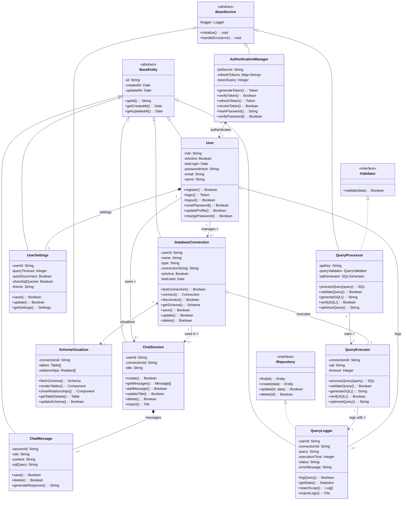

# Domain Class Diagram for SQL Chat Assistant



## Relationship Types

### Inheritance Hierarchies
1. **BaseEntity Hierarchy**
   - Abstract base class for all persistent entities
   - Provides common fields (id, timestamps)
   - Child classes: User, DatabaseConnection, ChatSession, ChatMessage, UserSettings, QueryLogger

2. **BaseService Hierarchy**
   - Abstract base class for all service components
   - Provides common functionality (logging, error handling)
   - Child classes: AuthenticationManager, QueryProcessor, SchemaVisualizer

3. **Interface Implementations**
   - IValidator: Implemented by QueryProcessor
   - IRepository: Implemented by QueryLogger

### Unidirectional Associations
1. **User → DatabaseConnection** (1-to-many)
   - A User manages multiple DatabaseConnections
   - Direction: User knows about its connections, but connections don't navigate back to User

2. **User → ChatSession** (1-to-many)
   - A User owns multiple ChatSessions
   - Direction: User can access its sessions, but sessions don't navigate back to User

3. **DatabaseConnection → ChatSession** (1-to-many)
   - A DatabaseConnection is used in multiple ChatSessions
   - Direction: Connection can find associated sessions, but sessions don't navigate back to all connections

4. **QueryProcessor → QueryExecutor** (1-to-1)
   - QueryProcessor uses QueryExecutor to execute queries
   - Direction: Processor accesses executor, but executor doesn't navigate back to processor

5. **QueryExecutor → QueryLogger** (1-to-1)
   - QueryExecutor logs its activities through QueryLogger
   - Direction: Executor uses logger, but logger doesn't navigate back to executor

### Bidirectional Associations
1. **DatabaseConnection ↔ SchemaVisualizer** (1-to-1)
   - Each DatabaseConnection has one SchemaVisualizer
   - Direction: Both classes know about each other and can navigate the relationship

2. **AuthenticationManager ↔ User** (1-to-1)
   - AuthenticationManager authenticates Users
   - Direction: Both classes know about each other and can navigate the relationship

### Composition (Strong Containment)
Composition indicates that the child objects cannot exist without the parent.

1. **User *-- UserSettings** (1-to-1)
   - A User completely owns its UserSettings
   - If User is deleted, UserSettings is also deleted
   - UserSettings cannot exist without its parent User

2. **ChatSession *-- ChatMessage** (1-to-many)
   - A ChatSession completely owns its ChatMessages
   - If ChatSession is deleted, all messages are also deleted
   - ChatMessages cannot exist without their parent ChatSession

### Aggregation (Weak Containment)
Aggregation indicates a "has-a" relationship where child objects can exist independently.

1. **User o-- QueryLogger** (1-to-many)
   - A User has multiple QueryLoggers
   - If User is deleted, QueryLogger can still exist
   - The QueryLogger is associated with but not exclusively owned by the User

2. **DatabaseConnection o-- QueryExecutor** (1-to-1)
   - A DatabaseConnection has a QueryExecutor
   - If DatabaseConnection is deleted, QueryExecutor can still exist
   - The QueryExecutor can be associated with other DatabaseConnections
```