# Implementation Class Diagram for SQL Chat Assistant

This diagram shows the concrete implementation details including specific technologies, frameworks, and implementation patterns.

```plantuml
@startuml SQL_Chat_Assistant_Implementation

' Style and layout settings with reduced internal spacing
skinparam classAttributeIconSize 0
skinparam shadowing false
skinparam linetype ortho
skinparam nodesep 30
skinparam ranksep 40
skinparam padding 5
skinparam ArrowColor black
skinparam ArrowThickness 1
skinparam DefaultFontSize 12
skinparam roundcorner 8
skinparam maxmessagesize 150
skinparam lineType polyline
skinparam packageStyle rectangle
skinparam packagePadding 5
hide empty members

' Color coding for different technology stacks
skinparam class {
  BackgroundColor<<Frontend>> #E8F1F5
  BorderColor<<Frontend>> #1A6ED8
  BackgroundColor<<Backend>> #F5E8E8
  BorderColor<<Backend>> #D81A1A
  BackgroundColor<<Database>> #EFF5E8
  BorderColor<<Database>> #68D81A
  BackgroundColor<<AI>> #F5E8F1
  BorderColor<<AI>> #D81A6E
  BackgroundColor<<SQLConn>> #F2FAFF
  BorderColor<<SQLConn>> #0066CC
}

' Layout organization by tech stack with tighter grouping
package "Frontend (Next.js)" {
  left to right direction
  skinparam groupInheritance 2
  
  class UserComponent<<Frontend>> {
    - useState, useEffect
    + login(), register(), logout()
  }
  
  class DatabaseConnectionComponent<<Frontend>> {
    - connections, selectedConn
    + addConnection(), testConnection()
  }
  
  class ChatSessionComponent<<Frontend>> {
    - messages, inputValue
    + sendMessage(), exportChat()
  }
  
  class SettingsComponent<<Frontend>> {
    - settings, isDirty
    + saveSettings(), updateTheme()
  }
  
  class AuthProvider<<Frontend>> {
    - session, user
    + signIn(), signOut()
  }
  
  class ThemeProvider<<Frontend>> {
    - theme
    + toggleTheme(), applyTheme()
  }
  
  class ApiService<<Frontend>> {
    - baseUrl, authToken
    + get(), post(), put(), delete()
  }
}

package "Backend (FastAPI)" {
  left to right direction
  skinparam groupInheritance 2
  
  class UserController<<Backend>> {
    - userService, authService
    + loginUser(), registerUser()
  }
  
  class ConnectionController<<Backend>> {
    - connectionService
    + getConnections(), testConnection()
  }
  
  class ChatController<<Backend>> {
    - chatService
    + getSessions(), addMessage() 
  }
  
  class QueryController<<Backend>> {
    - queryService, sqlGenerator
    + processNLQuery(), executeRawSQL()
  }
  
  class UserService<<Backend>> {
    - userRepo, passwordManager
    + findById(), createUser()
  }
  
  class ConnectionService<<Backend>> {
    - connRepo, encryptionService
    + findByUser(), testConnection()
  }
  
  class ChatService<<Backend>> {
    - sessionRepo, messageRepo
    + createSession(), generateResponse()
  }
  
  class QueryService<<Backend>> {
    - connService, sqlGenerator
    + processQuery(), executeSQL()
  }
  
  class SqlAlchemyORM<<Backend>> {
    - engine, sessionMaker
    + createSession(), query()
  }
  
  class TransactionManager<<Backend>> {
    - currentTransaction
    + begin(), commit(), rollback()
  }
}

package "SQL Database Connectors" {
  left to right direction
  skinparam groupInheritance 2
  
  interface IDatabaseConnector<<SQLConn>> {
    + connect(), disconnect()
    + executeQuery(), executeTransaction()
  }
  
  class PostgreSQLConnector<<SQLConn>> {
    - connectionPool
    + getConnection(), releaseConnection()
  }
  
  class MySQLConnector<<SQLConn>> {
    - connectionPool
    + getConnection(), releaseConnection()
  }
  
  class SQLServerConnector<<SQLConn>> {
    - connectionPool
    + getConnection(), releaseConnection()
  }
  
  class ConnectionPool<<SQLConn>> {
    - maxConnections, idleTimeout
    + getConnection(), releaseConnection()
  }
}

package "SQL Database (Tables)" {
  left to right direction
  skinparam groupInheritance 2
  
  class UsersTable<<Database>> {
    - id (PK), name, email, password_hash
    - created_at, updated_at
    + indexes: email_idx
  }
  
  class ConnectionsTable<<Database>> {
    - id (PK), user_id (FK), name, type
    - connection_string, is_active
    + indexes: user_id_idx, name_idx
  }
  
  class ChatSessionsTable<<Database>> {
    - id (PK), user_id (FK), connection_id (FK)
    - title, created_at
    + indexes: user_id_idx, connection_id_idx
  }
  
  class ChatMessagesTable<<Database>> {
    - id (PK), session_id (FK), role
    - content, sql_query, timestamp
    + indexes: session_id_idx, timestamp_idx
  }
  
  class QueryLogsTable<<Database>> {
    - id (PK), user_id (FK), connection_id (FK)
    - query, sql_query, status, execution_time
    + indexes: user_id_idx, timestamp_idx
  }
  
  class UserSettingsTable<<Database>> {
    - user_id (PK, FK), query_timeout
    - auto_disconnect, show_sql_queries, theme
    + indexes: user_id_idx
  }
}

package "AI Services (Gemini)" {
  left to right direction
  skinparam groupInheritance 2
  
  class GeminiClient<<AI>> {
    - apiKey, model, maxTokens
    + generateText(), generateSQL()
  }
  
  class SQLGenerator<<AI>> {
    - geminiClient, promptTemplate
    + generateSQLFromText(), optimizeSQL()
  }
  
  class QueryValidator<<AI>> {
    - sqlParser, schemaAnalyzer
    + validateSyntax(), checkForInjection()
  }
}

' Relationships - Frontend to Backend
UserComponent ..> ApiService : uses
DatabaseConnectionComponent ..> ApiService : uses
ChatSessionComponent ..> ApiService : uses
SettingsComponent ..> ApiService : uses

ApiService ..> UserController : calls
ApiService ..> ConnectionController : calls
ApiService ..> ChatController : calls
ApiService ..> QueryController : calls

UserComponent ..> AuthProvider : uses
SettingsComponent ..> ThemeProvider : uses

' Relationships - Backend Controllers to Services
UserController ..> UserService : uses
ConnectionController ..> ConnectionService : uses
ChatController ..> ChatService : uses
QueryController ..> QueryService : uses
QueryController ..> SQLGenerator : uses

' Relationships - Services to ORM and Transaction Manager
UserService ..> SqlAlchemyORM : uses
ConnectionService ..> SqlAlchemyORM : uses
ChatService ..> SqlAlchemyORM : uses
QueryService ..> SqlAlchemyORM : uses
QueryService ..> TransactionManager : uses

' Relationships - ORM to Database Connectors
SqlAlchemyORM ..> IDatabaseConnector : uses
IDatabaseConnector <|.. PostgreSQLConnector
IDatabaseConnector <|.. MySQLConnector
IDatabaseConnector <|.. SQLServerConnector
PostgreSQLConnector ..> ConnectionPool : uses
MySQLConnector ..> ConnectionPool : uses
SQLServerConnector ..> ConnectionPool : uses

' Relationships - Database Connectors to Tables
IDatabaseConnector ..> UsersTable : queries
IDatabaseConnector ..> ConnectionsTable : queries
IDatabaseConnector ..> ChatSessionsTable : queries
IDatabaseConnector ..> ChatMessagesTable : queries
IDatabaseConnector ..> QueryLogsTable : queries
IDatabaseConnector ..> UserSettingsTable : queries

' Relationships - Services to AI Services
ChatService ..> GeminiClient : uses
QueryService ..> SQLGenerator : uses
QueryService ..> QueryValidator : uses

' Relationships - AI Services
SQLGenerator ..> GeminiClient : uses
QueryValidator ..> SQLGenerator : uses

' Database table relationships
UsersTable "1" -- "0..*" ConnectionsTable : has >
UsersTable "1" -- "1" UserSettingsTable : has >
UsersTable "1" -- "0..*" ChatSessionsTable : owns >
ConnectionsTable "1" -- "0..*" ChatSessionsTable : used in >
ChatSessionsTable "1" -- "0..*" ChatMessagesTable : contains >
UsersTable "1" -- "0..*" QueryLogsTable : logs >

' Add a note about the layout optimization
note "Layout optimization:\n- Reduced node separation (nodesep=30)\n- Reduced rank separation (ranksep=40)\n- Left-to-right direction within packages\n- Reduced padding in classes and packages\n- Simplified class content for better visualization" as LayoutNote

@enduml
```

## Implementation Technologies

The implementation class diagram includes specific technologies used in the SQL Chat Assistant:

### Frontend Layer (Next.js)
- **Framework**: Next.js 14 (React framework)
- **State Management**: React Hooks (useState, useEffect)
- **Authentication**: NextAuth.js
- **UI Components**: Tailwind CSS, Shadcn UI
- **API Communication**: Axios with custom ApiService wrapper

### Backend Layer (FastAPI)
- **Framework**: FastAPI (Python web framework)
- **API Documentation**: OpenAPI/Swagger
- **Authentication**: JWT with PyJWT
- **Validation**: Pydantic for data validation
- **Error Handling**: Custom exception handlers
- **ORM**: SQLAlchemy for database interaction
- **Transaction Management**: SQLAlchemy session-based transactions

### Database Layer (SQL)
- **Database Types**: PostgreSQL, MySQL, SQL Server
- **Connection Handling**: Connection pooling
- **ORM Mapping**: SQLAlchemy models mapped to tables
- **Indexes**: Optimized indexes on frequently queried columns
- **Relationships**: Foreign key constraints for data integrity

### AI Components
- **LLM**: Google Gemini API
- **Query Processing**: Custom prompt engineering
- **SQL Generation**: Template-based prompt with schema context
- **Validation**: Custom SQL parser and validator

## Implementation Architecture Details

1. **Three-Tier Architecture**:
   - Presentation Layer: Next.js frontend components
   - Business Logic Layer: FastAPI controllers and services
   - Data Access Layer: SQLAlchemy ORM with SQL database

2. **API-First Design**:
   - RESTful API endpoints with standardized responses
   - Comprehensive OpenAPI documentation
   - Versioned API for backward compatibility

3. **Security Implementation**:
   - JWT-based authentication with refresh tokens
   - Password hashing with bcrypt
   - Connection string encryption with AES-256
   - CORS configuration for frontend/backend communication
   - SQL injection prevention through ORM and validators

4. **AI Integration**:
   - Asynchronous processing of natural language queries
   - Context-aware SQL generation using database schema
   - Semantic validation of generated SQL
   - Explanation capabilities for generated queries

5. **Database Connection Handling**:
   - Database connection pooling for performance
   - Automated disconnection of idle connections
   - Support for multiple SQL database types through adapter pattern
   - Schema introspection for visualization

6. **Data Access Pattern**:
   - Repository pattern for data access abstraction
   - ORM (SQLAlchemy) for SQL generation and mapping
   - Transaction management for data consistency
   - Proper indexing for query performance

7. **Error Handling Strategy**:
   - Centralized error handling middleware
   - Detailed error logging
   - User-friendly error messages
   - Retry mechanisms for transient failures

## SQL Database Design Considerations

1. **Table Structure**:
   - Primary and foreign key relationships clearly defined
   - Appropriate data types for each column
   - Timestamp fields for auditing (created_at, updated_at)

2. **Indexing Strategy**:
   - Primary key indexes on ID columns
   - Foreign key indexes for relationship columns
   - Additional indexes on frequently queried columns

3. **Query Optimization**:
   - Prepared statements for repeated queries
   - Query caching where appropriate
   - Execution plan analysis for complex queries

4. **Security**:
   - Parameterized queries to prevent SQL injection
   - Row-level security where needed
   - Encrypted sensitive data (connection strings)

## Layout Improvements
To reduce spacing between boxes within each technology package, the following changes were made:
- Decreased node separation (`nodesep`) and rank separation (`ranksep`) values
- Added left-to-right direction within packages to improve horizontal layout
- Reduced padding in both classes and packages
- Simplified class contents to show just key attributes and methods
- Added `skinparam groupInheritance` for compact inheritance visualization 